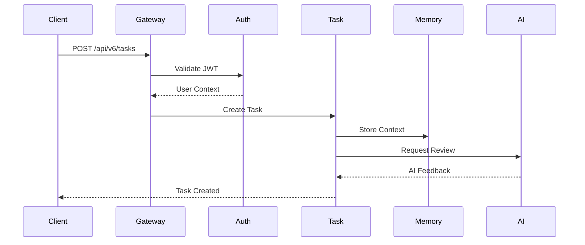
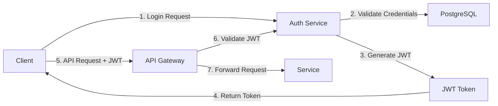

# ELWOSA Architecture Documentation

## System Overview

ELWOSA implements a modern microservices architecture designed for scalability, maintainability, and extensibility. The system follows Domain-Driven Design (DDD) principles with clear bounded contexts for each service.

## Architecture Principles

### 1. **Microservices Pattern**
- Each service owns its domain and data
- Services communicate via REST APIs and message queues
- Independent deployment and scaling capabilities

### 2. **API-First Design**
- All services expose RESTful APIs
- OpenAPI 3.0 specification for all endpoints
- Consistent error handling and response formats

### 3. **Event-Driven Architecture**
- WebSocket connections for real-time updates
- Event sourcing for audit trails
- Asynchronous processing for heavy operations

### 4. **Security by Design**
- Zero-trust network architecture
- Service-to-service authentication
- End-to-end encryption for sensitive data

## Core Components

### API Gateway (NGINX)
```nginx
upstream task_service {
    server task-service:8001;
}

upstream auth_service {
    server auth-service:8003;
}

server {
    listen 80;
    
    location /api/v6/tasks {
        proxy_pass http://task_service;
        proxy_set_header Authorization $http_authorization;
    }
    
    location /api/auth {
        proxy_pass http://auth_service;
    }
}
```

### Task Service Architecture

```python
# Domain Model Example
class Task:
    def __init__(self, title: str, priority: Priority):
        self.id = uuid.uuid4()
        self.title = title
        self.priority = priority
        self.steps = []
        self.created_at = datetime.utcnow()
        
    def add_step(self, content: str, user: str):
        step = TaskStep(content, user)
        self.steps.append(step)
        self.emit_event(TaskStepAdded(self.id, step))
```

### Service Communication



## Data Architecture

### PostgreSQL Schema Design

```sql
-- Tasks table with optimized indexes
CREATE TABLE tasks (
    id SERIAL PRIMARY KEY,
    task_id VARCHAR(50) UNIQUE NOT NULL,
    title VARCHAR(255) NOT NULL,
    description TEXT,
    priority VARCHAR(10) NOT NULL,
    status VARCHAR(50) DEFAULT 'open',
    estimated_hours INTEGER,
    actual_hours INTEGER,
    created_at TIMESTAMP DEFAULT CURRENT_TIMESTAMP,
    updated_at TIMESTAMP DEFAULT CURRENT_TIMESTAMP,
    
    -- AI Integration fields
    ai_review_needed BOOLEAN DEFAULT false,
    ai_review_status VARCHAR(50),
    ai_review_timestamp TIMESTAMP,
    
    -- JSONB for flexible data
    steps JSONB DEFAULT '[]',
    metadata JSONB DEFAULT '{}'
);

-- Indexes for performance
CREATE INDEX idx_tasks_priority ON tasks(priority);
CREATE INDEX idx_tasks_status ON tasks(status);
CREATE INDEX idx_tasks_ai_review ON tasks(ai_review_needed) 
    WHERE ai_review_needed = true;
CREATE INDEX idx_tasks_metadata ON tasks USING GIN(metadata);
```

### Data Flow Patterns

1. **Command Query Responsibility Segregation (CQRS)**
   - Write operations through Task Service
   - Read operations can bypass service layer for performance
   - Materialized views for complex queries

2. **Event Sourcing**
   - All state changes captured as events
   - Enables audit trail and time-travel debugging
   - Foundation for AI learning from patterns

## AI Integration Architecture

### Multi-Model Orchestration

```python
class AIOrchestrator:
    def __init__(self):
        self.models = {
            'gpt4': OpenAIModel(api_key=config.OPENAI_KEY),
            'claude': AnthropicModel(api_key=config.ANTHROPIC_KEY),
            'llama2': OllamaModel(host=config.OLLAMA_HOST)
        }
        
    async def process_task(self, task: Task, model_preference: str = None):
        # Intelligent model selection based on task type
        model = self._select_model(task, model_preference)
        
        # Context enrichment from Memory Service
        context = await self._get_context(task)
        
        # Stream response for better UX
        async for chunk in model.stream_completion(task, context):
            yield chunk
```

### Model Context Protocol (MCP) Integration

```typescript
// MCP Server Implementation
export class ElwosaMCPServer implements MCPServer {
    async handleRequest(request: MCPRequest): Promise<MCPResponse> {
        switch (request.method) {
            case 'task.create':
                return this.createTask(request.params);
            case 'task.analyze':
                return this.analyzeTask(request.params);
            case 'context.get':
                return this.getContext(request.params);
        }
    }
}
```

## Scalability Patterns

### Horizontal Scaling Strategy

1. **Service Level**
   - Kubernetes HPA based on CPU/Memory metrics
   - Custom metrics from Prometheus
   - Minimum 2 replicas for HA

2. **Database Level**
   - Read replicas for query distribution
   - Connection pooling with PgBouncer
   - Partitioning for large tables

3. **Caching Strategy**
   ```python
   # Redis caching with TTL
   @cache(ttl=300)
   async def get_task_summary(project_id: int):
       return await db.fetch_one("""
           SELECT COUNT(*) as total,
                  SUM(CASE WHEN status = 'completed' THEN 1 ELSE 0 END) as completed
           FROM tasks
           WHERE project_id = $1
       """, project_id)
   ```

## Monitoring & Observability

### Metrics Collection

```yaml
# Prometheus configuration
scrape_configs:
  - job_name: 'elwosa-services'
    kubernetes_sd_configs:
      - role: pod
    relabel_configs:
      - source_labels: [__meta_kubernetes_pod_annotation_prometheus_io_scrape]
        action: keep
        regex: true
```

### Distributed Tracing

```python
# OpenTelemetry integration
from opentelemetry import trace

tracer = trace.get_tracer(__name__)

@router.post("/tasks")
async def create_task(task: TaskCreate):
    with tracer.start_as_current_span("create_task") as span:
        span.set_attribute("task.priority", task.priority)
        # Business logic here
```

## Security Architecture

### Authentication Flow



### Security Layers

1. **Network Security**
   - TLS 1.3 for all communications
   - Service mesh with mTLS
   - Network policies in Kubernetes

2. **Application Security**
   - Input validation and sanitization
   - SQL injection prevention via parameterized queries
   - XSS protection in React frontend

3. **Data Security**
   - Encryption at rest (PostgreSQL TDE)
   - Sensitive data masking in logs
   - GDPR compliance features

## Performance Optimization

### Database Optimizations

```sql
-- Materialized view for dashboard
CREATE MATERIALIZED VIEW task_dashboard AS
SELECT 
    p.id as project_id,
    p.name as project_name,
    COUNT(t.id) as total_tasks,
    COUNT(t.id) FILTER (WHERE t.status = 'completed') as completed_tasks,
    AVG(t.actual_hours::float / NULLIF(t.estimated_hours, 0)) as avg_efficiency
FROM projects p
LEFT JOIN tasks t ON t.project_id = p.id
GROUP BY p.id, p.name;

-- Refresh strategy
CREATE OR REPLACE FUNCTION refresh_dashboard()
RETURNS void AS $$
BEGIN
    REFRESH MATERIALIZED VIEW CONCURRENTLY task_dashboard;
END;
$$ LANGUAGE plpgsql;
```

### Frontend Optimizations

```typescript
// React Query for efficient data fetching
const useTaskList = (projectId: number) => {
  return useQuery({
    queryKey: ['tasks', projectId],
    queryFn: () => fetchTasks(projectId),
    staleTime: 5 * 60 * 1000, // 5 minutes
    cacheTime: 10 * 60 * 1000, // 10 minutes
  });
};

// Virtualization for large lists
<VirtualList
  height={600}
  itemCount={tasks.length}
  itemSize={80}
  renderItem={({ index, style }) => (
    <TaskRow key={tasks[index].id} task={tasks[index]} style={style} />
  )}
/>
```

## Deployment Architecture

### Kubernetes Manifests

```yaml
apiVersion: apps/v1
kind: Deployment
metadata:
  name: task-service
spec:
  replicas: 3
  selector:
    matchLabels:
      app: task-service
  template:
    metadata:
      labels:
        app: task-service
    spec:
      containers:
      - name: task-service
        image: elwosa/task-service:latest
        ports:
        - containerPort: 8001
        env:
        - name: DATABASE_URL
          valueFrom:
            secretKeyRef:
              name: elwosa-secrets
              key: database-url
        resources:
          requests:
            memory: "256Mi"
            cpu: "250m"
          limits:
            memory: "512Mi"
            cpu: "500m"
        livenessProbe:
          httpGet:
            path: /health
            port: 8001
          initialDelaySeconds: 30
          periodSeconds: 10
```

### CI/CD Pipeline

```yaml
# GitHub Actions workflow
name: Deploy to Production
on:
  push:
    branches: [main]

jobs:
  deploy:
    runs-on: ubuntu-latest
    steps:
      - uses: actions/checkout@v3
      
      - name: Build and Push Docker Images
        run: |
          docker build -t elwosa/task-service:${{ github.sha }} ./services/task
          docker push elwosa/task-service:${{ github.sha }}
          
      - name: Deploy to Kubernetes
        run: |
          kubectl set image deployment/task-service \
            task-service=elwosa/task-service:${{ github.sha }}
          kubectl rollout status deployment/task-service
```

## Future Architecture Considerations

### 1. **Event Streaming with Kafka**
- Replace point-to-point communication
- Enable event replay and debugging
- Support for CQRS and Event Sourcing

### 2. **GraphQL Federation**
- Unified API gateway
- Schema stitching across services
- Better client performance

### 3. **Service Mesh (Istio)**
- Advanced traffic management
- Circuit breaking and retries
- Observability out of the box

### 4. **Multi-Region Deployment**
- Database replication strategies
- CDN for static assets
- Latency-based routing

---

This architecture provides a solid foundation for a scalable, maintainable, and extensible system that can grow with business needs while maintaining high performance and reliability standards.