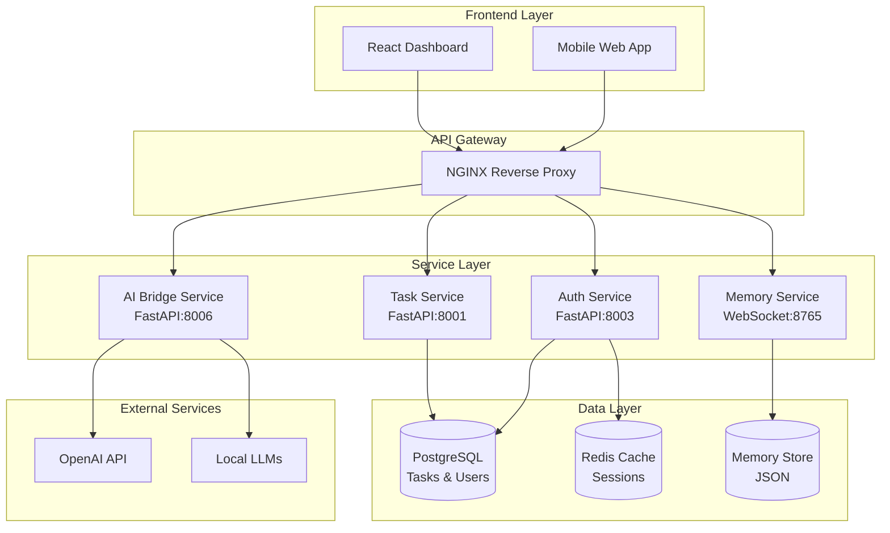
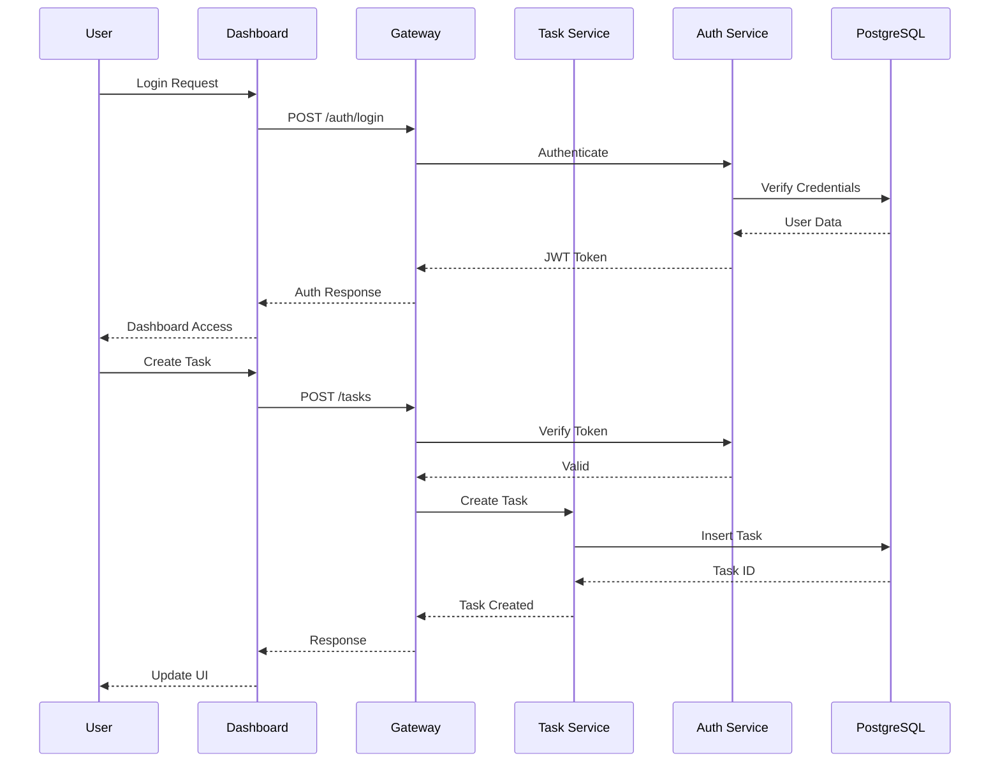
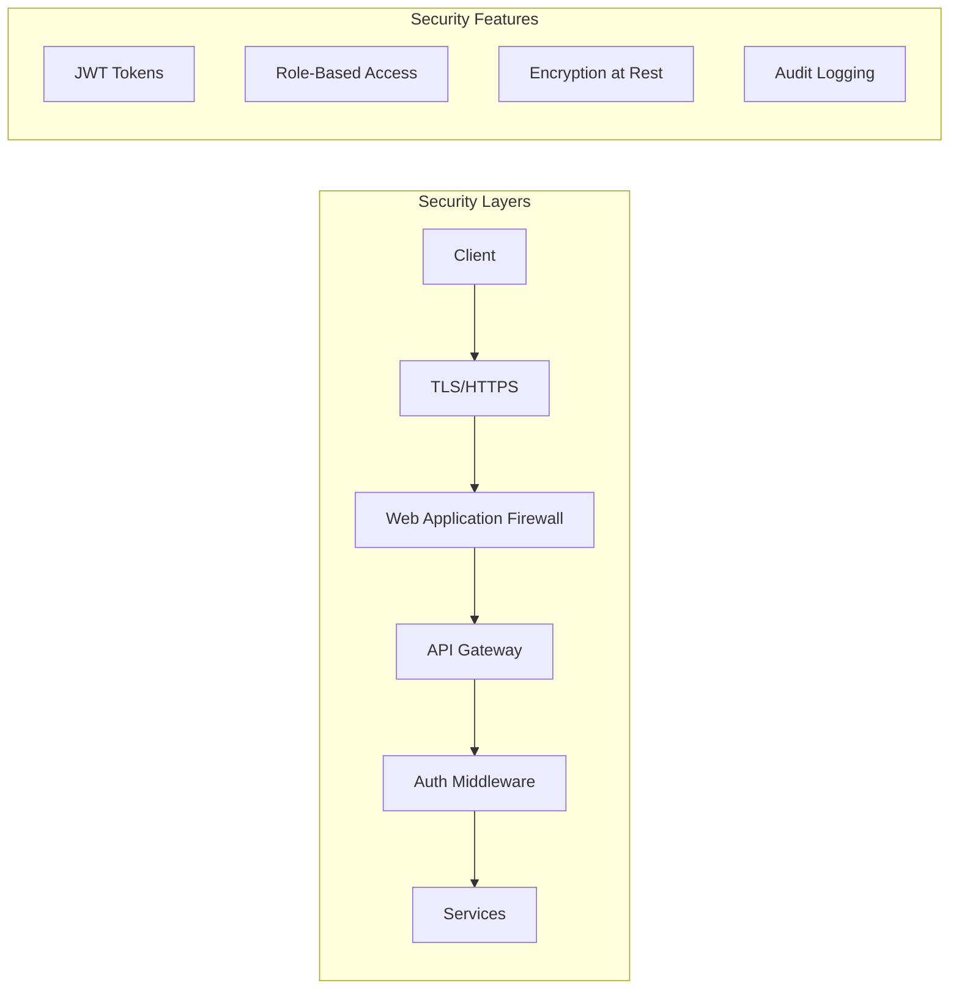

# ELWOSA System Architecture

## Overview

ELWOSA implements a modern microservices architecture designed for scalability, maintainability, and extensibility. The system follows Domain-Driven Design (DDD) principles and implements various enterprise patterns.

## System Components



## Core Services

### Task Management Service
- **Technology**: Python FastAPI
- **Port**: 8001
- **Responsibilities**:
  - CRUD operations for tasks
  - Priority management
  - Step tracking
  - Real-time updates

### Authentication Service
- **Technology**: Python FastAPI
- **Port**: 8003
- **Features**:
  - JWT token generation
  - User management
  - Role-based access control
  - Session management via Redis

### Memory Service
- **Technology**: Python WebSocket Server
- **Port**: 8765
- **Purpose**: Persistent system memory for AI context
- **Features**:
  - Real-time memory updates
  - Context preservation
  - WebSocket streaming

### AI Bridge Service
- **Technology**: Python FastAPI
- **Port**: 8006
- **Capabilities**:
  - Multi-model support (GPT-4, Llama, etc.)
  - Streaming responses
  - Context management
  - Load balancing

## Data Flow



## Design Patterns

### 1. **Microservices Pattern**
- Each service is independently deployable
- Services communicate via REST APIs
- Loose coupling, high cohesion

### 2. **API Gateway Pattern**
- Single entry point for all clients
- Request routing and load balancing
- Cross-cutting concerns (auth, logging)

### 3. **Repository Pattern**
- Data access abstraction
- Consistent interface for data operations
- Easy testing and mocking

### 4. **Event-Driven Architecture**
- WebSocket for real-time updates
- Event sourcing for audit trail
- Asynchronous processing

## Security Architecture



## Deployment Architecture

```yaml
version: '3.8'
services:
  nginx:
    image: nginx:alpine
    ports:
      - "80:80"
      - "443:443"
    volumes:
      - ./nginx.conf:/etc/nginx/nginx.conf
      
  task-service:
    build: ./backend/task-service
    environment:
      - DB_HOST=postgres
      - REDIS_HOST=redis
    depends_on:
      - postgres
      - redis
      
  auth-service:
    build: ./backend/auth-service
    environment:
      - JWT_SECRET=${JWT_SECRET}
      - DB_HOST=postgres
      
  postgres:
    image: postgres:14
    volumes:
      - postgres_data:/var/lib/postgresql/data
      
  redis:
    image: redis:alpine
    volumes:
      - redis_data:/data
```

## Scalability Considerations

1. **Horizontal Scaling**: Services can be replicated behind load balancer
2. **Database Sharding**: PostgreSQL supports partitioning for large datasets
3. **Caching Strategy**: Redis for session and frequently accessed data
4. **Async Processing**: Task queues for long-running operations

## Monitoring & Observability

- **Metrics**: Prometheus + Grafana
- **Logging**: ELK Stack (Elasticsearch, Logstash, Kibana)
- **Tracing**: OpenTelemetry
- **Health Checks**: Built into each service

## Future Enhancements

1. **GraphQL Gateway**: For flexible client queries
2. **Service Mesh**: Istio for advanced traffic management
3. **Event Streaming**: Apache Kafka for real-time data pipeline
4. **ML Pipeline**: Dedicated service for AI model management