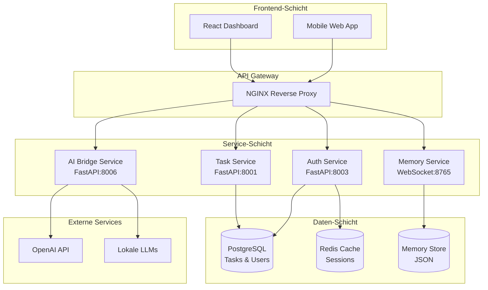
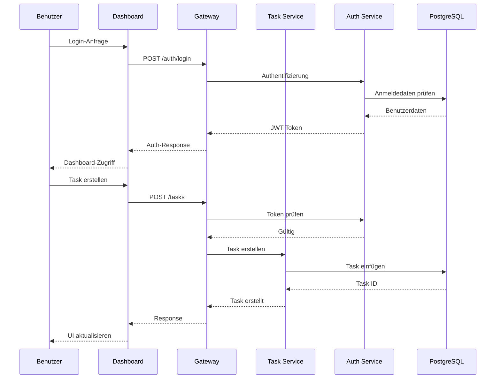
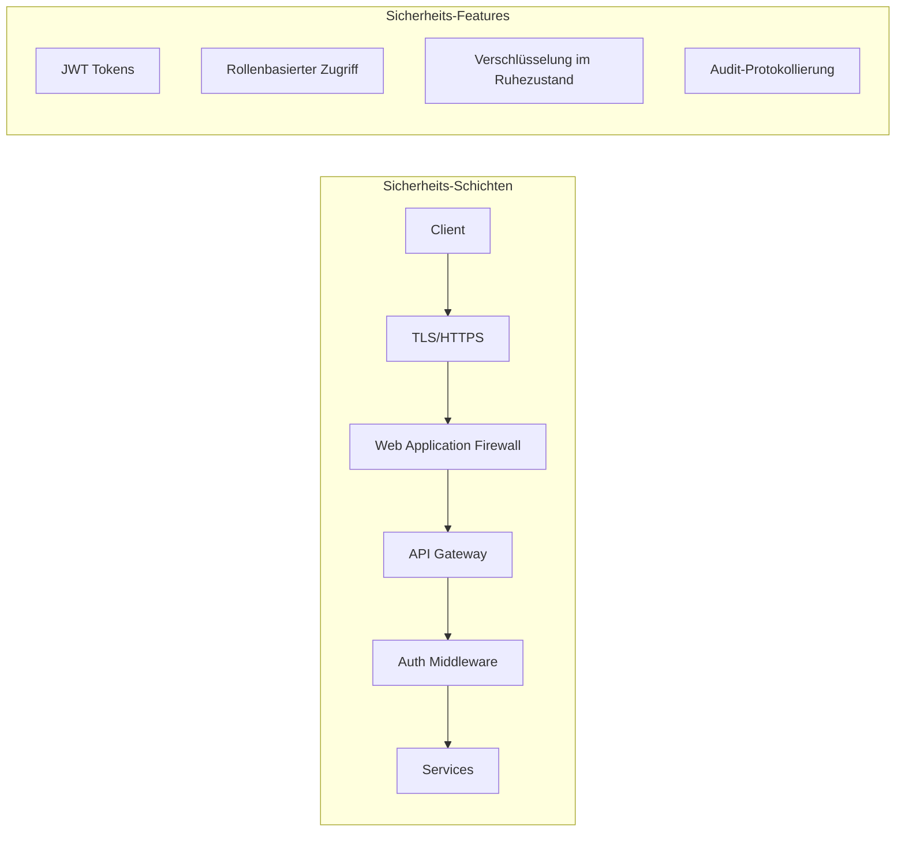

# ELWOSA System-Architektur

## Überblick

ELWOSA implementiert eine moderne Microservices-Architektur, die für Skalierbarkeit, Wartbarkeit und Erweiterbarkeit konzipiert ist. Das System folgt Domain-Driven Design (DDD) Prinzipien und implementiert verschiedene Enterprise-Patterns.

## System-Komponenten



## Kern-Services

### Task Management Service
- **Technologie**: Python FastAPI
- **Port**: 8001
- **Verantwortlichkeiten**:
  - CRUD-Operationen für Tasks
  - Prioritäts-Management
  - Schritt-Verfolgung
  - Echtzeit-Updates

### Authentication Service
- **Technologie**: Python FastAPI
- **Port**: 8003
- **Features**:
  - JWT-Token-Generierung
  - Benutzer-Management
  - Rollenbasierte Zugriffskontrolle
  - Session-Management via Redis

### Memory Service
- **Technologie**: Python WebSocket Server
- **Port**: 8765
- **Zweck**: Persistenter System-Speicher für KI-Kontext
- **Features**:
  - Echtzeit-Speicher-Updates
  - Kontext-Bewahrung
  - WebSocket-Streaming

### AI Bridge Service
- **Technologie**: Python FastAPI
- **Port**: 8006
- **Fähigkeiten**:
  - Multi-Model-Support (GPT-4, Llama, etc.)
  - Streaming-Antworten
  - Kontext-Management
  - Load Balancing

## Datenfluss



## Design-Patterns

### 1. **Microservices Pattern**
- Jeder Service ist unabhängig deploybar
- Services kommunizieren via REST APIs
- Lose Kopplung, hohe Kohäsion

### 2. **API Gateway Pattern**
- Einzelner Eingangspunkt für alle Clients
- Request-Routing und Load Balancing
- Querschnittsfunktionen (Auth, Logging)

### 3. **Repository Pattern**
- Datenbank-Abstraktion
- Konsistente Schnittstelle für Datenoperationen
- Einfaches Testen und Mocking

### 4. **Event-Driven Architecture**
- WebSocket für Echtzeit-Updates
- Event Sourcing für Audit Trail
- Asynchrone Verarbeitung

## Sicherheits-Architektur



## Deployment-Architektur

```yaml
version: '3.8'
services:
  nginx:
    image: nginx:alpine
    ports:
      - "80:80"
      - "443:443"
    volumes:
      - ./nginx.conf:/etc/nginx/nginx.conf
      
  task-service:
    build: ./backend/task-service
    environment:
      - DB_HOST=postgres
      - REDIS_HOST=redis
    depends_on:
      - postgres
      - redis
      
  auth-service:
    build: ./backend/auth-service
    environment:
      - JWT_SECRET=${JWT_SECRET}
      - DB_HOST=postgres
      
  postgres:
    image: postgres:14
    volumes:
      - postgres_data:/var/lib/postgresql/data
      
  redis:
    image: redis:alpine
    volumes:
      - redis_data:/data
```

## Skalierbarkeits-Überlegungen

1. **Horizontale Skalierung**: Services können hinter Load Balancer repliziert werden
2. **Datenbank-Sharding**: PostgreSQL unterstützt Partitionierung für große Datensätze
3. **Caching-Strategie**: Redis für Session- und häufig abgerufene Daten
4. **Asynchrone Verarbeitung**: Task-Queues für lang andauernde Operationen

## Monitoring & Observability

- **Metriken**: Prometheus + Grafana
- **Protokollierung**: ELK Stack (Elasticsearch, Logstash, Kibana)
- **Tracing**: OpenTelemetry
- **Health Checks**: In jeden Service integriert

## Zukünftige Verbesserungen

1. **GraphQL Gateway**: Für flexible Client-Abfragen
2. **Service Mesh**: Istio für erweiterte Traffic-Verwaltung
3. **Event Streaming**: Apache Kafka für Echtzeit-Daten-Pipeline
4. **ML Pipeline**: Dedizierter Service für KI-Model-Management