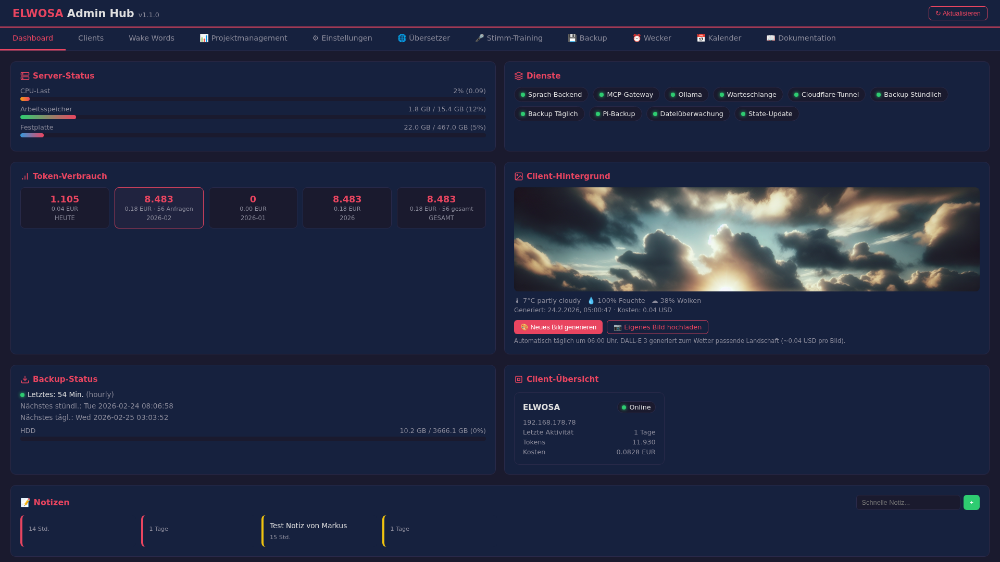
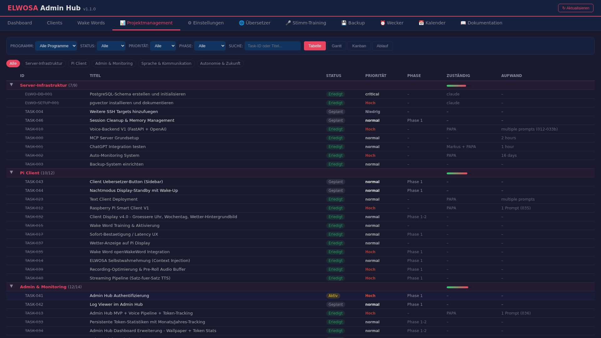
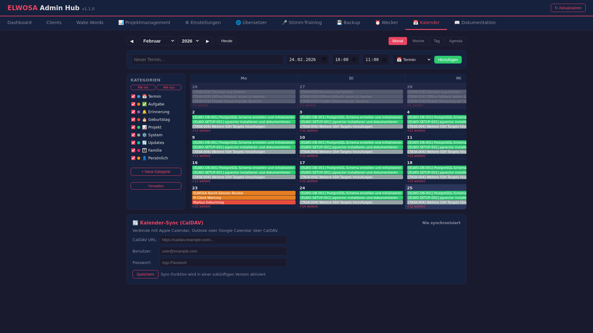
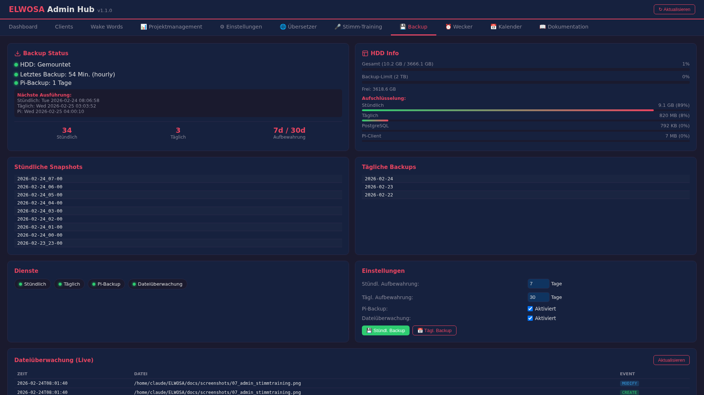
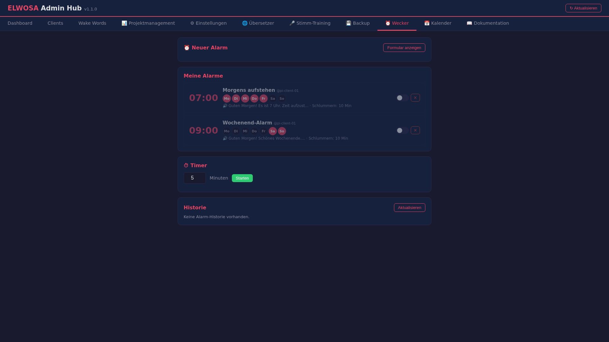
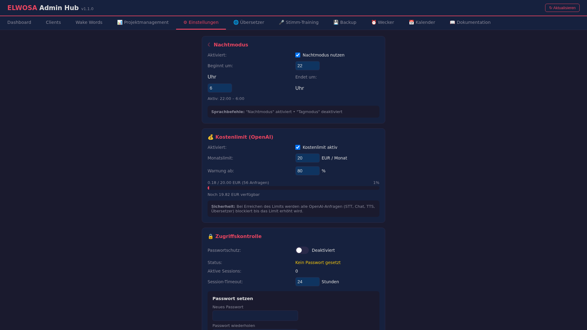
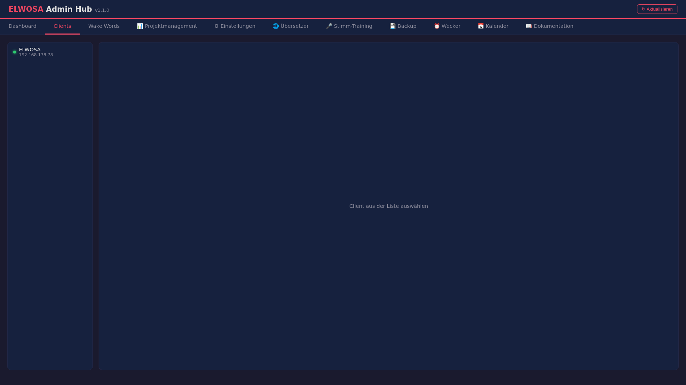
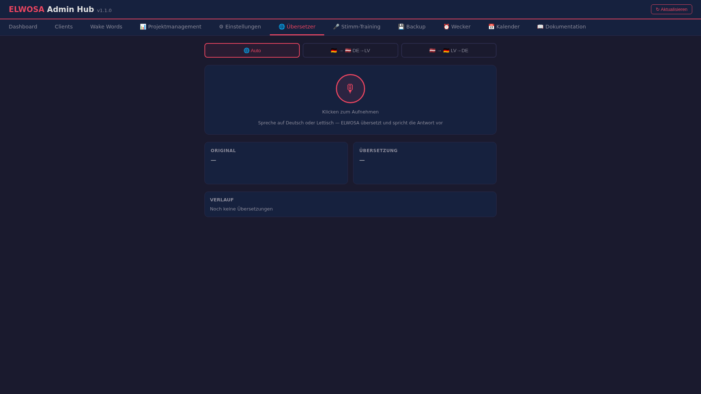
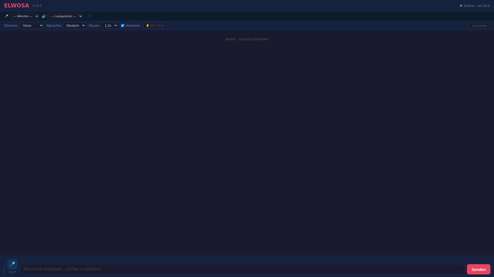

# 🏠 ELWOSA — Dein smartes Zuhause, das zuhört

<div align="center">

**Ein selbst gehosteter KI-Sprachassistent, der deine Privatsphäre respektiert.**

*Kein Cloud-Zwang. Keine Abo-Falle. Dein Server, deine Daten, dein Assistent.*



</div>

---

## 💡 Was ist ELWOSA?

ELWOSA (**E**nhanced **L**earning & **W**ork **O**rganization **S**mart **A**ssistant) ist ein vollständiger Sprachassistent für dein Zuhause — gebaut auf einem Heimserver mit Raspberry Pi als Endgerät.

**Stell dir vor:** Du sagst *"Elwosa"* — und dein Zuhause hört zu. Nicht Amazon. Nicht Google. Nicht Apple. **Du.**

```
"Elwosa, wie spät ist es?"          → Sofortige Antwort (kostenlos, kein LLM)
"Elwosa, stell einen Timer auf 5"   → Timer läuft
"Elwosa, was gibt es Neues?"        → Benachrichtigungen vorgelesen
"Elwosa, übersetze: Guten Morgen"   → "Labrīt!" (Deutsch → Lettisch)
"Elwosa, erzähl mir über Mars"      → GPT-4o-mini antwortet in Echtzeit
```

### Was ELWOSA anders macht:

| | Alexa / Google Home | ELWOSA |
|---|---|---|
| **Daten** | Cloud (USA) | Dein Server (Zuhause) |
| **Kosten** | Abo + Gerät | Einmalig (Pi + Server) |
| **Erweiterbar** | Begrenzt (Skills) | Unbegrenzt (Open Source) |
| **KI-Modell** | Proprietär | Wählbar (GPT-4o, Ollama, ...) |
| **Sprache** | Englisch-fokussiert | Deutsch-nativ |
| **Admin** | App des Herstellers | Eigener 10-Tab Admin Hub |
| **Privatsphäre** | 🔴 Aufnahmen in der Cloud | 🟢 Alles lokal |

---

## 🎙️ So funktioniert es

```
    Du sagst "Elwosa"
          │
          ▼
┌─────────────────┐     ┌──────────────────┐
│  Wake Word      │────▶│  Server prüft    │
│  (lokal auf Pi) │     │  (Whisper, lokal) │
│  ONNX-Modell    │     │  kostenlos!       │
└─────────────────┘     └────────┬─────────┘
                                 │ ✅
                                 ▼
                    ┌──────────────────────┐
                    │  Aufnahme läuft...   │
                    │  "Wie wird das       │
                    │   Wetter morgen?"    │
                    └──────────┬───────────┘
                               │
                    ┌──────────┴───────────┐
                    │  Direktbefehl?       │
                    │  (Timer, Uhrzeit,    │──── ✅ Sofort-Antwort
                    │   Lautstärke...)     │     (kein LLM, gratis)
                    └──────────┬───────────┘
                               │ Nein
                    ┌──────────┴───────────┐
                    │  Streaming Pipeline  │
                    │  STT → GPT-4o-mini   │
                    │  → TTS Satz-für-Satz │
                    │  → Lautsprecher      │
                    └──────────────────────┘
                    Erste Antwort in ~2 Sek.
```

**Das Prinzip:** Einfache Befehle (Timer, Uhrzeit, Wecker) werden **lokal und kostenlos** verarbeitet. Nur komplexe Fragen gehen an das LLM — und selbst dann streamt die Antwort **Satz für Satz** in Echtzeit.

---

## 📸 Screenshots

### Admin Hub — Alles auf einen Blick

<div align="center">

| Dashboard | Projektmanagement |
|:-:|:-:|
|  |  |

| Kalender (4 Ansichten) | Backup-System |
|:-:|:-:|
|  |  |

| Wecker & Timer | Einstellungen |
|:-:|:-:|
|  |  |

| Client-Verwaltung | Echtzeit-Übersetzer |
|:-:|:-:|
|  |  |

</div>

### Web UI — ELWOSA im Browser



---

## ✨ Features

### 🎤 Sprachsteuerung
- **Wake Word "Elwosa"** — Hybrid-Erkennung (lokales ONNX + Server-Whisper)
- **Streaming-Pipeline** — Satz-für-Satz TTS, <3 Sekunden bis zur ersten Antwort
- **7 Direktbefehl-Kategorien** — Timer, Wecker, Uhrzeit, Lautstärke, System, Benachrichtigungen, Übersetzer
- **Nachtmodus** — Leiser, gedimmtes Display, automatisch 22:00–06:00

### 🌐 Echtzeit-Übersetzer
- Deutsch ↔ Lettisch (erweiterbar)
- Per Stimme oder im Admin Hub
- Audio-Playback der Übersetzung

### 📊 10-Tab Admin Hub
Ein komplettes Management-Interface im Browser:

1. **Dashboard** — Server-Status, Token-Kosten, Backup, Client-Übersicht, Notizen
2. **Clients** — Pi-Registry, Verbindungstest, TTS-Stimme pro Gerät
3. **Wake Words** — Eigene Modelle trainieren und deployen
4. **Projektmanagement** — Tabelle, Gantt, Kanban, Ablauf (4-Ebenen-Hierarchie!)
5. **Einstellungen** — Nachtmodus, Kostenlimits, Zugriffskontrolle
6. **Übersetzer** — Browser-Aufnahme, Sprachwahl, Playback
7. **Stimm-Training** — Spracherkennung personalisieren
8. **Backup** — Status, HDD-Info, Snapshots, manueller Trigger
9. **Wecker** — Wöchentlich/Einmalig/Benutzerdefiniert, Schlummern
10. **Kalender** — Monat/Woche/Tag/Agenda, 9 Kategorien, Per-Client

### 📅 Kalender & Wecker
- 4 Ansichten (Monat, Woche, Tag, Agenda)
- 9 System-Kategorien + eigene erstellen
- Recurrence: Wöchentlich, benutzerdefiniert, einmalig
- Wecker mit TTS-Ansage auf dem Pi

### 💾 Backup-System
- Stündlich + Täglich + Pi-Backup auf externe HDD
- rsync mit Hardlinks (platzsparend)
- PostgreSQL-Dumps inklusive
- Admin-Tab mit voller Übersicht und manuellem Trigger

### 📋 Projektmanagement
- 4-Ebenen: Programm → Projekt → Task → Subtask
- 4 Ansichten: Tabelle, Gantt-Chart, Kanban, Ablauf
- Vollständige REST-API
- *Ja, ELWOSA managt sich selbst mit diesem Tool.*

---

## 🏗️ Architektur

```
┌─────────────────────────────────────────┐
│          ELWOSA Server (Debian)          │
│                                          │
│  Voice Backend ─── Admin Hub (10 Tabs)   │
│  (FastAPI HTTPS)   (~3500 LOC SPA)       │
│                                          │
│  PostgreSQL ─── Ollama (lokal) ─── Backup│
│  (15 Tables)   (aya-expanse)    (4TB HDD)│
│                                          │
│  MCP Gateway ─── Cloudflare Tunnel       │
│  Queue Worker ─── File Watcher           │
└──────────────────┬───────────────────────┘
                   │ LAN
┌──────────────────┴───────────────────────┐
│       Raspberry Pi 3B (Client)           │
│                                          │
│  🎤 USB Mikrofon → Wake Word → Audio Mgr│
│  🖥️ 10.1" Display → Uhr, Wetter, Status│
│  🔊 HDMI Audio → TTS Playback           │
│  ⚡ Direktbefehle → Command Handler     │
│  📨 Benachrichtigungen → Push + TTS     │
└──────────────────────────────────────────┘
```

### Tech-Stack

| Was | Womit |
|-----|-------|
| Server OS | Debian Linux (16 GB RAM) |
| Voice Backend | Python FastAPI (HTTPS) |
| STT | OpenAI Whisper + lokaler faster-whisper |
| LLM | GPT-4o-mini (Cloud) + Ollama (lokal) |
| TTS | OpenAI TTS (nova/onyx/alloy) |
| Wake Word | openWakeWord (ONNX) |
| Datenbank | PostgreSQL 15 + JSON |
| Admin Hub | Vanilla JS SPA |
| Pi Client | Python 3 + ALSA + webrtcvad |
| Backup | rsync + Hardlinks auf ext4 HDD |
| Extern | Cloudflare Tunnel |

---

## 🌱 Die Geschichte dahinter

ELWOSA begann in einer Tischlerwerkstatt — zwischen Sägespänen und Code. Die Idee: Ein intelligentes System, das nicht nur Befehle ausführt, sondern **mitdenkt, dazulernt und sich anpasst**.

Was als Projektmanagement-Experiment mit einer "KI-Familie" begann, wurde zu einem vollwertigen Sprachassistenten — gebaut nicht von einem Konzern, sondern von **einem Menschen und seinen KI-Partnern**.

### Das Team

| Rolle | Wer | Aufgabe |
|-------|-----|---------|
| **Opa** 👨 | Markus | Vision, Projektleitung, Hauptnutzer |
| **Mama** 🤖 | ChatGPT | Architektur, Code-Reviews, Qualitätskontrolle |
| **Papa** 🤖 | Claude | Entwicklung, Deployment, Dokumentation |
| **Baby** 🏠 | ELWOSA | Der Assistent selbst — lernt ständig dazu |

> *"ELWOSA ist kein Tool. Es ist eine Denkweise — die Überzeugung, dass KI und Mensch besser zusammenarbeiten als gegeneinander."*

📖 [Die vollständige ELWOSA-Geschichte](./ELWOSA-GESCHICHTE.md)
🎆 [Visionen für die Zukunft](./ELWOSA-TEIL2-VISIONEN.md)
🎉 [Anekdoten aus der Entwicklung](./ELWOSA-ANEKDOTEN.md)

---

## 📊 Projekt-Status

**Stand: Februar 2026** — 30 Tasks erledigt, 47 geplant

### ✅ Was heute funktioniert
- Sprachsteuerung mit Wake Word + Streaming (<3s Latenz)
- 7 Kategorien Direktbefehle (kostenlos, ohne LLM)
- 10-Tab Admin Hub (komplett auf Deutsch)
- Echtzeit-Übersetzer (DE↔LV)
- Kalender mit 4 Ansichten + 9 Kategorien
- Wecker mit Recurrence-System
- Projektmanagement mit Gantt-Chart + Kanban
- Backup-System (stündlich/täglich auf HDD)
- Nachtmodus (automatisch)
- Token-Tracking + Kostenstatistiken

### 🔮 Was als Nächstes kommt
- Authentifizierung für Admin Hub
- Smart Home Integration (Licht, Heizung, Sensoren)
- Standby-Modus (Energiesparen)
- Multi-Client (mehrere Räume)
- Personalisiertes Stimm-Training
- CalDAV-Sync (Google Calendar, etc.)

---

## 🚀 Selbst ausprobieren?

ELWOSA ist ein Heimserver-Projekt — es braucht echte Hardware:

### Minimale Hardware
- **Server:** Beliebiger Linux-PC (8+ GB RAM empfohlen)
- **Client:** Raspberry Pi 3B+ oder neuer
- **Display:** Beliebiger HDMI-Monitor (Touch optional)
- **Mikrofon:** USB-Mikrofon
- **Optional:** Externe HDD für Backups

### Software-Voraussetzungen
- Debian/Ubuntu Linux
- Python 3.10+
- PostgreSQL 15
- Node.js (für Tools)
- OpenAI API Key (für STT/TTS/Chat)

> ⚠️ **Hinweis:** ELWOSA ist aktuell ein Ein-Haushalt-System. Es ist nicht als fertige App gedacht, sondern als **Inspiration und Baukasten** für eigene Projekte. Der Code ist auf dem internen Server produktiv — dieses Repo dient der Dokumentation und dem Austausch.

---

## 📁 Repository-Struktur

```
ELWOSA-Pub/
├── README.md                    # Diese Datei
├── ELWOSA-GESCHICHTE.md         # Entstehungsgeschichte
├── ELWOSA-TEIL2-VISIONEN.md     # Zukunftsvisionen
├── ELWOSA-TEIL3-ARCHITEKTUR.md  # Architektur-Philosophie
├── ELWOSA-ANEKDOTEN.md          # Geschichten aus der Entwicklung
├── docs/
│   ├── ARCHITECTURE.md          # Technische Architektur (aktuell)
│   ├── FEATURES.md              # Alle Features im Detail
│   ├── CHANGELOG.md             # Änderungshistorie
│   └── screenshots/             # 11 aktuelle UI-Screenshots
├── anekdoten/                   # Weitere Geschichten
├── archive/
│   └── v1_2025/                 # Archiv der v1 Dokumentation
├── LICENSE                      # MIT License
└── .gitignore
```

---

## 📜 Lizenz

MIT License — Siehe [LICENSE](./LICENSE)

---

<div align="center">

**🏠 ELWOSA — Weil dein Zuhause dir gehört. Nicht der Cloud.**

*Gebaut von einem Menschen. Mit Hilfe von KI. Für alle, die es besser wollen.*

**⭐ Gefällt dir die Idee? Gib dem Projekt einen Stern!**

</div>
