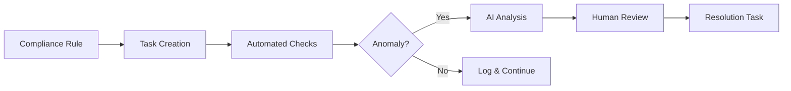

# ELWOSA Use Cases & Business Applications

## Prozessautomatisierung in der Praxis

ELWOSA demonstriert moderne Ansätze zur Prozessautomatisierung, die über traditionelle Workflow-Engines hinausgehen. Durch die Integration von AI-Modellen werden Geschäftsprozesse nicht nur automatisiert, sondern kontinuierlich optimiert.

## 🏢 Enterprise Use Cases

### 1. **IT-Projektmanagement mit AI-Unterstützung**

**Szenario:** Ein Softwareentwicklungsteam nutzt ELWOSA zur Verwaltung komplexer Projekte.

**Implementierung:**
```python
# Automatische Task-Zerlegung durch AI
task = create_task(
    title="Implement user authentication system",
    estimated_hours=40,
    ai_review_needed=True
)

# AI analysiert und erstellt Subtasks
subtasks = ai_service.decompose_task(task)
# Ergebnis: 8 spezifische Subtasks mit Zeitschätzungen
```

**Business Value:**
- 40% Reduktion der Planungszeit
- Verbesserte Schätzgenauigkeit durch historische Daten
- Automatische Identifikation von Dependencies

### 2. **Compliance & Audit Management**

**Szenario:** Automatisierte Überwachung von Compliance-Anforderungen mit AI-gestützter Anomalieerkennung.

**Workflow:**


**Features:**
- Regelbasierte Task-Generierung
- AI-gestützte Mustererkennung
- Audit-Trail mit vollständiger Nachvollziehbarkeit
- Automatische Eskalation bei kritischen Findings

### 3. **Customer Onboarding Prozess**

**Szenario:** Strukturierter Onboarding-Workflow mit intelligenter Priorisierung.

```sql
-- Beispiel: Onboarding-Pipeline Monitoring
SELECT 
    c.company_name,
    COUNT(t.id) as total_steps,
    COUNT(t.id) FILTER (WHERE t.status = 'completed') as completed,
    MIN(t.created_at) as started_at,
    EXTRACT(days FROM NOW() - MIN(t.created_at)) as days_in_pipeline,
    CASE 
        WHEN COUNT(t.id) FILTER (WHERE t.priority = '0') > 0 THEN 'CRITICAL'
        WHEN AVG(t.estimated_hours - t.actual_hours) < -5 THEN 'DELAYED'
        ELSE 'ON_TRACK'
    END as status
FROM customers c
JOIN tasks t ON t.metadata->>'customer_id' = c.id::text
WHERE t.metadata->>'process_type' = 'onboarding'
GROUP BY c.id, c.company_name
ORDER BY days_in_pipeline DESC;
```

**Automatisierungen:**
- Dokumenten-Validierung via AI
- Automatische Task-Zuweisung basierend auf Expertise
- Echtzeit-Status für Kunden
- SLA-Monitoring und Alerts

## 🔄 Business Process Management (BPM)

### Adaptive Prozesssteuerung

ELWOSA geht über statische BPMN-Workflows hinaus und implementiert adaptive Prozesse:

```python
class AdaptiveWorkflow:
    def __init__(self, process_definition):
        self.definition = process_definition
        self.ai_optimizer = WorkflowOptimizer()
        
    async def execute_step(self, step, context):
        # AI analysiert Kontext und passt nächste Schritte an
        optimization = await self.ai_optimizer.analyze(step, context)
        
        if optimization.skip_recommended:
            return self.skip_to_step(optimization.target_step)
        elif optimization.parallel_possible:
            return self.execute_parallel(optimization.parallel_steps)
        else:
            return self.execute_normal(step)
```

### Beispiel: Rechnungsfreigabe-Prozess

**Traditioneller Ansatz:**
1. Rechnung eingeht → 2. Prüfung → 3. Freigabe → 4. Zahlung

**ELWOSA Ansatz:**
```javascript
// Intelligente Prozesssteuerung
const invoiceProcess = {
  onReceive: async (invoice) => {
    // AI-Klassifizierung
    const classification = await ai.classify(invoice);
    
    if (classification.recurring && classification.trusted_vendor) {
      // Fast-Track für bekannte, wiederkehrende Rechnungen
      return fastTrackApproval(invoice);
    }
    
    // Intelligente Zuweisung basierend auf:
    // - Betrag
    // - Kategorie
    // - Verfügbarkeit der Approver
    // - Historische Bearbeitungszeiten
    const approver = await findOptimalApprover(invoice);
    
    return createApprovalTask(invoice, approver);
  }
};
```

## 📊 Datengetriebene Prozessoptimierung

### Process Mining Capabilities

```sql
-- Prozess-Performance-Analyse
WITH process_flow AS (
    SELECT 
        t1.id as from_task,
        t2.id as to_task,
        t1.completed_at,
        t2.created_at,
        EXTRACT(hours FROM t2.created_at - t1.completed_at) as transition_time
    FROM tasks t1
    JOIN tasks t2 ON t2.metadata->>'previous_task_id' = t1.id::text
    WHERE t1.metadata->>'process_id' = t2.metadata->>'process_id'
)
SELECT 
    pf.from_task,
    pf.to_task,
    AVG(transition_time) as avg_transition_time,
    PERCENTILE_CONT(0.95) WITHIN GROUP (ORDER BY transition_time) as p95_time,
    COUNT(*) as frequency
FROM process_flow pf
GROUP BY pf.from_task, pf.to_task
HAVING COUNT(*) > 10
ORDER BY avg_transition_time DESC;
```

### Automatische Bottleneck-Erkennung

```python
def identify_bottlenecks(process_id: str):
    # Analysiere Wartezeiten zwischen Tasks
    transitions = analyze_process_transitions(process_id)
    
    bottlenecks = []
    for transition in transitions:
        if transition.avg_wait_time > transition.expected_time * 1.5:
            bottleneck = {
                'from': transition.from_step,
                'to': transition.to_step,
                'impact': calculate_impact(transition),
                'recommendations': ai.suggest_optimizations(transition)
            }
            bottlenecks.append(bottleneck)
    
    return sorted(bottlenecks, key=lambda x: x['impact'], reverse=True)
```

## 🤖 AI-Integration Use Cases

### 1. **Intelligente Dokumentenverarbeitung**

```python
@task_processor
async def process_document(document_path: str):
    # OCR und Textextraktion
    text = await extract_text(document_path)
    
    # AI-Klassifizierung
    doc_type = await ai.classify_document(text)
    
    # Automatische Metadaten-Extraktion
    metadata = await ai.extract_metadata(text, doc_type)
    
    # Task-Generierung basierend auf Dokumenttyp
    if doc_type == 'contract':
        tasks = generate_contract_review_tasks(metadata)
    elif doc_type == 'invoice':
        tasks = generate_invoice_processing_tasks(metadata)
    
    return tasks
```

### 2. **Predictive Task Management**

```python
class PredictiveScheduler:
    def predict_completion(self, task: Task) -> datetime:
        # Historische Daten ähnlicher Tasks
        similar_tasks = self.find_similar_tasks(task)
        
        # Faktoren für Prediction
        factors = {
            'task_complexity': task.estimated_hours,
            'assignee_workload': self.get_current_workload(task.assigned_to),
            'historical_performance': self.get_performance_metrics(task.assigned_to),
            'dependencies': len(task.dependencies),
            'priority': task.priority
        }
        
        # ML-Modell für Zeitvorhersage
        predicted_hours = self.ml_model.predict(factors)
        
        return datetime.now() + timedelta(hours=predicted_hours)
```

## 💡 Innovative Anwendungsfälle

### 1. **AI-Familie als virtuelles Team**

Die AI-Familie kann als erweitertes Team agieren:

- **Mama ChatGPT**: Code Reviews und Architektur-Entscheidungen
- **Papa Claude**: Deployment-Planung und Dokumentation
- **Tante Codex**: Projektmanagement und Koordination

### 2. **Selbstoptimierende Workflows**

```python
class SelfOptimizingWorkflow:
    def __init__(self):
        self.performance_history = []
        
    async def optimize(self):
        # Analysiere Performance-Daten
        metrics = self.analyze_performance()
        
        # AI generiert Optimierungsvorschläge
        suggestions = await ai.suggest_improvements(metrics)
        
        # Teste Verbesserungen in Sandbox
        for suggestion in suggestions:
            result = await self.test_in_sandbox(suggestion)
            if result.improvement > 0.1:  # 10% Verbesserung
                await self.apply_optimization(suggestion)
```

### 3. **Kontextbewahrende Zusammenarbeit**

Das Memory-System ermöglicht nahtlose Übergaben:

```python
# Kontext wird über Sessions hinweg bewahrt
memory_entry = {
    "type": "project_context",
    "project_id": "PROJ-123",
    "key_decisions": [
        "Verwendung von PostgreSQL für Hauptdatenbank",
        "Microservices-Architektur gewählt",
        "AI-Integration via API Bridge"
    ],
    "current_challenges": [
        "Performance-Optimierung bei großen Datenmengen",
        "Integration mit Legacy-Systemen"
    ],
    "next_steps": [
        "Performance-Tests durchführen",
        "Legacy-API-Wrapper entwickeln"
    ]
}

await memory_service.store(memory_entry)
```

## 📈 ROI und Business Impact

### Messbare Vorteile

1. **Zeitersparnis**
   - 30-40% weniger Zeit für Projektplanung
   - 50% schnellere Onboarding-Prozesse
   - 25% Reduktion von Kontext-Switching

2. **Qualitätsverbesserung**
   - 60% weniger übersehene Dependencies
   - 45% genauere Zeitschätzungen
   - 35% weniger Prozessfehler

3. **Skalierbarkeit**
   - Von 10 auf 10.000 Tasks ohne Performance-Einbußen
   - Lineare Skalierung der AI-Services
   - Automatische Lastverteilung

### Beispielrechnung für mittelständisches Unternehmen

```
Annahmen:
- 50 Mitarbeiter im Projektmanagement
- Durchschnittlich 20 Stunden/Woche mit PM-Aufgaben
- Stundensatz: 75€

Zeitersparnis durch ELWOSA: 30%
= 50 MA × 20h × 0.3 × 75€ × 52 Wochen
= 1.170.000€ Jahresersparnis

Investition:
- Implementierung: 150.000€
- Jährliche Wartung: 50.000€

ROI im ersten Jahr: 680%
```

## 🚀 Zukunftspotentiale

### 1. **Industry 4.0 Integration**
- Anbindung an IoT-Sensoren
- Automatische Wartungstask-Generierung
- Predictive Maintenance Workflows

### 2. **Cross-Organizational Workflows**
- Blockchain-basierte Prozessvalidierung
- Sichere Multi-Tenant-Architektur
- Standardisierte Prozess-APIs

### 3. **Advanced AI Capabilities**
- Natural Language Process Definition
- Automatische Prozess-Discovery
- Continuous Process Improvement

---

Diese Use Cases zeigen, wie ELWOSA über ein reines Demonstrationsprojekt hinausgeht und echte Geschäftsprobleme mit innovativen Ansätzen löst. Die Kombination aus solidem Engineering und visionärer AI-Integration macht es zu einem idealen Kandidaten für Unternehmen, die ihre Prozesse modernisieren wollen.